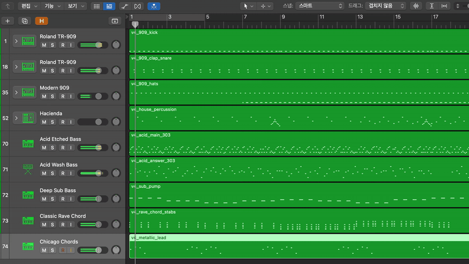

<p align="center">
  
</p>

<p align="center">
  <strong>The missing agent control plane for Logic Pro.</strong><br/>
  A production-oriented MCP server that lets Claude, Cursor, and custom MCP agents operate Logic Pro with state, provenance, and fail-closed safety gates.
</p>

<p align="center">
  <a href="https://swift.org"></a>
  <a href="https://developer.apple.com/macos/"></a>
  <a href="https://modelcontextprotocol.io"></a>
  <a href="https://github.com/MongLong0214/logic-pro-mcp/actions/workflows/ci.yml"></a>
  <a href="LICENSE"></a>
  <a href="https://discord.gg/4M3s79DBzz"></a>
  
  
</p>

<p align="center">
  <a href="docs/media/logic-pro-mcp-demo.mp4">
    
  </a>
</p>

<p align="center">
  Actual Logic Pro 12.2 capture, cropped from a live playback recording.<br/>
  <a href="docs/media/logic-pro-mcp-demo.mp4">6 sec MP4</a>
</p>

---

Logic Pro does not ship a first-party API for agentic composition, session setup, mixer operations, or live project readback. Logic Pro MCP fills that gap by combining **7 native macOS control channels** behind one MCP interface, then wrapping every high-risk operation in explicit state, confirmation, and verification contracts.

The result is not "screen automation with prompts." It is a structured server for DAW agents: tools mutate, resources read, evidence is labeled, and uncertain outcomes stay uncertain instead of being reported as success.

```
You: "Make a 4-bar techno loop in A minor at 140 BPM"

MCP client → logic_tracks.record_sequence {
  bar: 1, tempo: 140,
  notes: "45,0,95;57,107,95;45,214,95;..."
}
MCP client → logic_tracks.set_instrument {
  index: 0, path: "Electronic Drums/Roland TR-909"
}

Logic Pro MCP: region imported, instrument routed, readback exposed through resources.
```

## At a Glance

| Surface | Current source tree |
|---------|---------------------|
| MCP tools | 10 tools covering transport, tracks, mixer, MIDI, edit, navigation, project lifecycle, audio artifact analysis, system health, and verified plugin apply-back |
| Read resources | 18 static resources for health, transport, tracks, mixer, markers, project metadata, project audit/cleanup planning, MIDI ports, MCU state, library inventory, stock plugin/instrument intelligence, Session Players, and workflow skills |
| Resource templates | 11 templates for track, region, mixer-strip, stock plugin detail/search, stock instrument detail/search, Session Player detail, session-plan dry run, and workflow detail/search lookup |
| Control channels | MCU, Accessibility, AppleScript, CoreMIDI, CGEvent, Scripter, MIDI Key Commands |
| Verification line | Current source tree: `1859` Swift tests, release build, and strict fresh live Logic E2E `352/352` |
| Release state | Published stable `v3.7.3`; previous stable `v3.7.2` remains available for pinned installs |
| Community layer | Official Discord for setup support, release notes, reproducible bug triage, product requests, demos, and contributor discussion |

If this project helps you make music with Claude, Cursor, or any MCP client, star the repo. It helps the project reach more Logic Pro users and maintainers.

Want to contribute? Start with the [Contributing Guide](CONTRIBUTING.md) and the [open issues](https://github.com/MongLong0214/logic-pro-mcp/issues?q=is%3Aissue%20is%3Aopen). Many docs, examples, validation tests, and CLI-message improvements do not require Logic Pro.

## Community

Join the official Logic Pro MCP Discord: [https://discord.gg/4M3s79DBzz](https://discord.gg/4M3s79DBzz).

Discord is the real-time community layer for setup help, release discussion, bug triage, product requests, demos, and contributor coordination. GitHub Issues remain the canonical tracker for reproducible bugs, feature requests, and decisions that need to stay searchable.

## Why It Exists

Most Logic Pro automation attempts fall into one of three traps:

1. **Prompt-only recipes** that drift away from the real tool surface.
2. **Keyboard macro automation** that can click the wrong target and still look successful.
3. **Single-channel control** that can write to Logic but cannot reliably read what Logic actually did.

Logic Pro MCP uses a different model. It routes each operation to the strongest available channel, exposes live state through MCP resources, and forces callers to handle three outcomes: confirmed, uncertain, or failed.

## What It Controls

| Area | What agents can do | Safety/readback model |
|------|--------------------|-----------------------|
| Transport | Play, stop, record, locate, cycle, metronome, tempo | CoreMIDI/AX routing with live `logic://transport/state` readback |
| Tracks | Create, delete, duplicate, select, rename, mute, solo, arm, set instruments | Mutating targets require explicit index/name; uncertain selection fails closed before writes |
| MIDI composition | Generate SMF server-side, import MIDI, send notes/CC/MMC, create virtual ports | `.mid` imports are constrained to server-managed temp files and must create a live track |
| Mixer | Volume, pan, plugin snapshots, guarded stock plugin insertion | AX writes with same-surface readback for volume/pan (since #83); MCU writes for master/send; occupied plugin slots refuse replacement |
| Library | Scan Logic's instrument library and load patches by path | Disk/AX inventory is cached and path-allowlisted |
| Navigation | Bars, markers, zoom, view toggles | Marker navigation is target-faithful; cold-cache misses return failure instead of "next marker" |
| Project lifecycle | New, open, save, save-as, close, bounce, export plan, quit | Destructive operations require confirmation; dry-run export plans do not open Logic or write artifacts |

## Agent-Grade Surfaces

**Tools are for actions and local artifact checks.** The public write surface is intentionally small: `logic_transport`, `logic_tracks`, `logic_mixer`, `logic_plugins`, `logic_midi`, `logic_edit`, `logic_navigate`, `logic_project`, and `logic_system`. `logic_audio` is read-only and verifies exported files after Logic writes them.

**Resources are for state.** Clients should read `logic://transport/state`, `logic://tracks`, `logic://mixer`, `logic://project/info`, `logic://project/audit`, `logic://project/cleanup-plan`, `logic://midi/ports`, and related resources instead of burning tool calls on polling.

**Evidence is separated from claims.** The README points to release evidence, current-main verification, and live media artifacts instead of implying that a successful command equals a verified Logic state.

## Trust Model

- **Honest Contract envelopes**: mutating operations return State A confirmed, State B uncertain with a reason, or State C failure with an error.
- **Verified plugin apply-back**: `logic_plugins.*` uses HC v2 (`hc_schema: 2`) and returns State A only after project identity, target track, physical insert slot, plugin identity, and readback all agree.
- **Fail-closed targets**: dangerous mixer, marker, track, MIDI import, and plugin operations require explicit targets and validation.
- **Confirmation levels**: destructive/project and plugin insertion flows require explicit confirmation metadata before execution.
- **Provenance labels**: read surfaces expose source, freshness, and evidence labels instead of forcing clients to guess.
- **Installer hardening**: Homebrew pins SHA256; the shell installer refuses to run without explicit hash/team pins unless same-origin provenance is explicitly allowed.
- **Release honesty**: published `v3.7.3` is the current stable install line, and README claims stay tied to shipped artifacts, release-tree tests, or explicitly linked live evidence.

## Quick Start

**Prerequisites**: macOS 14+, Logic Pro 12.0.1+, `cliclick`, and an MCP client that can launch a stdio server. Published GitHub Actions/Homebrew assets are universal (`arm64` + `x86_64`) and do not require Xcode. Homebrew installs `cliclick` automatically; source builds and the pinned shell installer expect it to already be present (`brew install cliclick`).

The package manifest uses Swift tools 6.0 for compatibility. Current source verification uses Xcode 16.4 / Swift 6.2 in CI.

The current published stable release is `v3.7.3` (2026-06-30 KST). It ships ADHOC-signed universal artifacts when Apple Developer ID credentials are absent, plus `SHA256SUMS.txt` and `RELEASE-METADATA.json` for pinned installs. It carries the full v3.7.x runtime surface (10-tool / 18-resource / 11-template) and adds the v3.7.3 issue-backlog bug-fix pass: `set_tempo` now fails closed with State C `readback_mismatch` instead of claiming a slider-increment success it cannot verify, MIDI import preflights Automation → System Events (a separate TCC target) and the `--check-permissions` readiness gate now reflects it, blocking-dialog refusals carry the dialog identity plus a recovery action, fresh-session bootstrap clears unnamed Save prompts via an Escape fallback, and `logic_key_event` accepts `--return`/`--enter` aliases with a `--check` preflight.

### 1. Install

```bash
brew tap MongLong0214/logic-pro-mcp https://github.com/MongLong0214/logic-pro-mcp
brew trust monglong0214/logic-pro-mcp   # Homebrew 6.0+ requires trusting third-party taps
brew install logic-pro-mcp
```

The Homebrew formula pins both the release tarball URL and its SHA256; Homebrew itself is a trusted delivery channel with its own signature chain. This is the hardened path for production installs. (On Homebrew older than 6.0 the `brew trust` step does not exist — skip it.)

For source-tree development, build locally:

```bash
git clone https://github.com/MongLong0214/logic-pro-mcp.git
cd logic-pro-mcp
swift build -c release
```

### 2. Register with an MCP client

Claude Code:

```bash
claude mcp add --scope user logic-pro -- LogicProMCP
```

Generic MCP client config:

```json
{
  "mcpServers": {
    "logic-pro": {
      "command": "LogicProMCP"
    }
  }
}
```

If you built from source, point the command at `.build/release/LogicProMCP`.

### 3. Complete Logic Pro setup

Run the local checks:

```bash
LogicProMCP --check-permissions
```

Then complete the two Logic-side setup steps in [docs/SETUP.md](docs/SETUP.md):

- Register the `LogicProMCP-MCU-Internal` MCU control surface.
- Add the bundled Scripter insert if you need plugin-parameter writes.

Logic 12.2+ does not auto-import the legacy Key Commands plist; the bundled preset is staged as a Manual MIDI Learn reference.

### 4. Test from your agent

Ask the client:

> Check Logic Pro MCP health and show all ready channels.

Expected: all 7 channels `ready` after full setup, or 5 if you intentionally skipped Key Commands and Scripter.

### Pinned shell installer

The installer is **fail-closed**: it refuses to run without explicit `LOGIC_PRO_MCP_SHA256` + `LOGIC_PRO_MCP_TEAM_ID` env pins. It verifies the downloaded `LogicProMCP-macOS-universal.tar.gz` archive, so copy the SHA from that archive entry in the release's `SHA256SUMS.txt`:

```bash
brew install cliclick
curl -fsSL https://raw.githubusercontent.com/MongLong0214/logic-pro-mcp/v3.7.3/Scripts/install.sh -o install.sh
# inspect install.sh, then:
LOGIC_PRO_MCP_SHA256=<paste LogicProMCP-macOS-universal.tar.gz SHA256SUMS entry> \
LOGIC_PRO_MCP_TEAM_ID=<paste team_id from RELEASE-METADATA.json> \
bash install.sh
```

If you knowingly accept same-origin provenance (hash + Team ID fetched from the same release as the binary), opt in explicitly:

```bash
LOGIC_PRO_MCP_ALLOW_SAME_ORIGIN=1 \
bash <(curl -fsSL https://raw.githubusercontent.com/MongLong0214/logic-pro-mcp/v3.7.3/Scripts/install.sh)
```

See [SECURITY.md §Installer trust model](SECURITY.md#installer-trust-model) for the trust tiers and threat model.

## Architecture at a Glance

MCP clients launch the Swift stdio server. Dispatchers validate tool parameters, `ChannelRouter` chooses the strongest available macOS channel, resources expose cached/live state, and high-risk writes return explicit confirmed/uncertain/failed envelopes. The core channels are MCU, Accessibility, AppleScript, CoreMIDI, CGEvent, Scripter, and MIDI Key Commands.

## Documentation

| Document | Audience | Purpose |
|----------|----------|---------|
| [Setup Guide](docs/SETUP.md) | End users | Install, MCP registration, Logic Pro integration, doctor anchors |
| [API Reference](docs/API.md) | End users, MCP clients | All 10 tools, 18 resources, 11 templates, Honest Contract, verified apply-back |
| [Troubleshooting](docs/TROUBLESHOOTING.md) | End users | Common failures and fixes |
| [Security Policy](SECURITY.md) | Security reviewers | Threat model, reporting, hardening |
| [Changelog](CHANGELOG.md) | Everyone | Per-release changes |
| [Contributing](CONTRIBUTING.md) | Contributors | Dev setup, scoped PR workflow, PR verification |

The public docs tree is intentionally scoped: setup, API, troubleshooting, README media, plus public issue PRDs/tickets that explain active or shipped user-visible remediation. Historical release notes, internal PRDs, private ticket boards, spike notes, and local live-evidence work files are kept out of `docs/`; public release history belongs in [CHANGELOG.md](CHANGELOG.md), GitHub Releases, merged PRs, and issue history.

## Status

**Published stable**: `v3.7.3` is available as a GitHub Release and Homebrew install. It carries the accumulated v3.6.0 -> v3.7.2 set, then adds the v3.7.3 issue-backlog bug-fix pass: a fail-closed `set_tempo` slider-increment path (State C `readback_mismatch`, never a false success), an Automation → System Events preflight for MIDI import plus a `--check-permissions` readiness gate that exits non-zero when that target is denied, blocking-dialog refusals enriched with dialog identity and a Cancel-first recovery action, a fresh-session bootstrap Escape fallback for unnamed Save prompts, and `logic_key_event` `--return`/`--enter`/`--check` support. Published metadata remains `team_id:"ADHOC"` / `signing:"adhoc"` when Developer ID credentials are absent, with universal `x86_64` + `arm64` artifacts produced by GitHub Actions.

**Previous stable**: `v3.7.2` remains available as the production-readiness hardening release; `v3.7.1` remains available as the public documentation/runtime-surface correction release, `v3.7.0` as the full workflow/demo hardening release, and `v3.6.0` for clients that need the verified plugin apply-back surface without the larger v3.7.x set.

## Verification

| Gate | Current evidence |
|------|------------------|
| Full deterministic suite | Current source tree: `swift test` -> `1859` passed, `0` failed |
| Release build | Current source tree: `swift build -c release` passed |
| Python E2E syntax | PR #24 verification: `python3 -m py_compile Scripts/live-e2e-test.py` passed |
| Targeted live plugin proof | Logic Pro 12.2: `logic_plugins.insert_verified track=6 insert=6 plugin=Gain` returned State A with `observed_slot:6`, `write_source:"ax_exact_slot_popup"`, and independent `get_inventory` readback |
| Track/transport readback proof | Logic Pro 12.2: `logic://tracks` returned `source:"ax_live"`, real names, `placeholder_count:0`, `unknown_type_count:0`; cycle toggle/resource roundtrip reflected live UI state |
| Strict live Logic Pro 12.2 | Current source tree strict fresh live E2E: `352` passed / `0` skipped / `0` failed |
| README media | Actual Logic Pro 12.2 capture derivatives are published under `docs/media/` |
| v3.7.3 release evidence | GitHub Release, Actions logs, and [CHANGELOG.md](CHANGELOG.md) |

Live E2E defaults to the release binary. Protocol/security assertions run on any host; Logic/CoreMIDI-dependent checks skip unless a real Logic Pro session is visible. Strict mode converts live-gated skips to failures, treats missing project state as a failed cycle roundtrip precondition, and launches the MCP server under a trusted shell/tmux parent so macOS TCC evaluates the same parent context used by live client flows.

## API Contracts That Matter

- **Honest Contract envelope** — every mutating op returns State A confirmed, State B uncertain with `reason`, or State C hard failure with `error`. See [docs/API.md](docs/API.md).
- **HC v2 plugin apply-back** — `logic_plugins.get_inventory`, `set_param_verified`, and `insert_verified` add `state` + `hc_schema: 2`; State C always carries `verified:false`, `write_attempted`, retry safety, and target identity where relevant.
- **Fail-closed mutation targets** — mixer faders, plugin params, marker delete/rename, track delete/duplicate, and MIDI imports require explicit target parameters.
- **Exact-slot plugin insertion** — `logic_plugins.insert_verified` targets the physical insert index returned by `get_inventory`, verifies the popup is anchored to that slot, and confirms success only by post-write inventory diff.
- **Target-faithful navigation** — `goto_marker` returns `element_not_found` on a cold cache instead of advancing to the next marker.
- **1-based MIDI channel** — `send_note`, `send_cc`, and `record_sequence` `ch` values accept 1..16 to match Logic's UI.
- **Bounded raw SysEx** — `send_sysex` rejects payloads over 1024 bytes before CoreMIDI routing.
- **Audible-bounce guardrails** — `record_sequence` refuses unverified GM Device / External MIDI imports, `logic://project/audit` marks External MIDI tracks with MIDI regions as export blockers, and `logic_project.bounce` refuses those blockers before opening the Bounce dialog.
- **Audit phase split** — audit logs distinguish rejected calls, confirmation prompts, and executed route invocations.
- **Verified project saves** — `project.save_as` verifies the target `.logicx` package exists and that existing packages advance modification time.
- **Live project metadata** — `logic://project/info` promotes live transport tempo/sample-rate when available and falls back per-field to saved project metadata.
- **Side-effect-free reads** — resources expose state, metadata, and cached inventory without mutating Logic.

## Release & Distribution

Stable production tags use the GitHub Actions release workflow. `RELEASE-METADATA.json` records the exact signing mode, Team ID, and architectures for each artifact. When Developer ID credentials are absent, releases publish ADHOC artifacts with SHA256 metadata and install validation rather than pretending to be notarized.

Per-release detail lives in [CHANGELOG.md](CHANGELOG.md). Security and installer trust tiers are documented in [SECURITY.md](SECURITY.md).

## Registry Metadata

The repository ships `server.json` for the official MCP Registry metadata path. The record is metadata-only because the registry package schema does not yet model Homebrew formulas or GitHub release tarballs as first-class package types. The install authority remains the pinned GitHub Release/Homebrew path above.

## Known Limitations

- **Tempo typing**: `transport.set_tempo` falls back to slider increments when Logic's tempo display cannot accept text input; sub-10-BPM precision may require setting tempo manually once in Logic.
- **MIDI region padding**: `record_sequence` regions start at bar 1 and extend to the target bar using inaudible padding; note timing inside the region is exact, but the region can look longer than the phrase.
- **External MIDI bounce readiness**: MIDI regions on GM Device / External MIDI tracks are not accepted as audible-bounce evidence by project audit or `logic_project.bounce`. Move or recreate the material on Software Instrument tracks before claiming a verified Logic Bounce.
- **MIDI Key Commands**: Logic 12.2 does not accept the legacy `.plist` Key Commands import; manual MIDI Learn remains required for keycmd-only operations.
- **Markers**: `logic://markers` returns `[]` honestly when the Marker List window is closed on Logic 12.2; auto-opening that window is not shipped because it changes focus.
- **Plugin parameter readback**: `logic_plugins.set_param_verified` live-verifies Compressor `threshold` through the open plugin window; arbitrary plugin parameters remain future work and fail closed with `unsupported_param_readback`.
- **Plugin window opening**: parameter apply-back still needs the target plugin window already open in Logic Pro; exact-slot plugin insertion itself does not require a pre-opened plugin window.

## Development

Source builds require Xcode 16.4+ / Swift 6.2 for the current verified toolchain.

```bash
swift test --no-parallel
swift build -c release
python3 -m py_compile Scripts/live-e2e-test.py
```

For live attestation on a configured Logic Pro host:

```bash
LOGIC_PRO_MCP_STRICT_LIVE=1 Scripts/live-e2e-test.sh
```

## License

MIT. See [LICENSE](LICENSE).

## Contributing

Bug reports, PRs, and feature discussions are welcome. See [CONTRIBUTING.md](CONTRIBUTING.md) and the [open issues](https://github.com/MongLong0214/logic-pro-mcp/issues?q=is%3Aissue%20is%3Aopen) for the dev workflow.

Security vulnerabilities: please do **not** open a public issue. See [SECURITY.md](SECURITY.md) for the private disclosure process.
